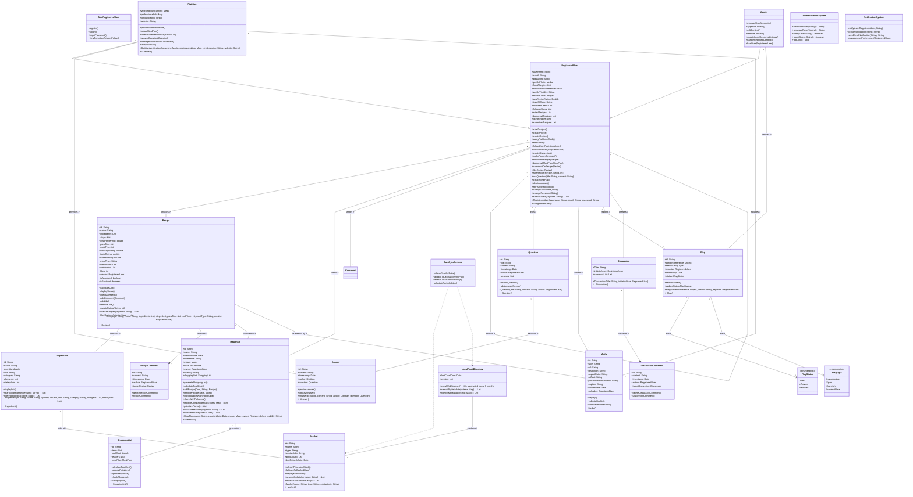

```mermaid
classDiagram
%%{ init: { "theme": "default", "flowchart": { "curve": "linear" }, "viewBox": true } }%%

  class RegisteredUser {
    +username: String
    +email: String
    +password: String
    +profilePhoto: Media
    +foodAllergies: List<String>
    +notificationPreferences: Map<String, Boolean>
    +profileVisibility: String
    +recipeCount: Integer
    +avgRecipeRating: Double
    +typeOfCook: String
    +followedUsers: List<RegisteredUser>
    +followerUsers: List<RegisteredUser>
    +ratedRecipes: List<Recipe,Double,Double>
    +bookmarkRecipes: List<Recipe>
    +likedRecipes: List<Recipe>
    +viewRecipes()
    +createProfile()
    +createRecipe()
    +applyForHomeCook()
    +editProfile()
    +followUser(RegisteredUser)
    +unFollowUser(RegisteredUser)
    +createDiscussion()
    +makeForumComment()
    +bookmarkRecipe(Recipe)
    +bookmarkMealPlan(MealPlan)
    +submittedRecipes: List<Recipe>
    +commentOnRecipe(Recipe)
    +likeRecipe(Recipe)
    +rateRecipe(Recipe, String, int)
    +askQuestion(title: String, content: String)
    +createMealPlan()
    +deleteAccount()
    +retryDeleteAccount()
    +changeUsername(String)
    +changePassword(String)
    +searchUsers(keyword: String): List<RegisteredUser>
    +RegisteredUser(username: String, email: String, password: String)
    +~RegisteredUser()
  }

  class NonRegisteredUser {
    +register()
    +signIn()
    +forgotPassword()
    +viewTermsAndPrivacyPolicy()
  }

  class Discussion {
    +Title: String
    +initiatorUser: RegisteredUser
    +commentList: List<DiscussionComment>
    +Discussion(Title: String, initiatorUser: RegisteredUser)
    +~Discussion()
  }

  class Dietitian {
    +verificationDocument: Media
    +professionalInfo: Map<String, String>
    +clinicLocation: String
    +website: String
    +provideNutritionAdvice()
    +createMealPlan()
    +rateRecipeHealthiness(Recipe, int)
    +answerQuestion(Question)
    +manageProfessionalDashboard()
    +verifyAccount()
    +Dietitian(verificationDocument: Media, professionalInfo: Map<String, String>, clinicLocation: String, website: String)
    +~Dietitian()
  }
  Dietitian --|> RegisteredUser

  class Admin {
    +manageUserAccounts()
    +approveContent()
    +editContent()
    +removeContent()
    +updateLocalResourceListings()
    +handleReportedContent()
    +banUser(RegisteredUser)
  }
  Admin --|> RegisteredUser

  class Recipe {
    +id: String
    +name: String
    +ingredients: List<Ingredient>
    +steps: List<String>
    +costPerServing: double
    +prepTime: int
    +cookTime: int
    +difficultyRating: double
    +tasteRating: double
    +healthRating: double
    +mealType: String
    +mediaFiles: List<Media>
    +comments: List<RecipeComment>
    +likes: int
    +creator: RegisteredUser
    +isApproved: boolean
    +isFeatured: boolean
    +calculateCost()
    +displaySteps()
    +checkAllergens()
    +addComment(Comment)
    +addLike()
    +removeLike()
    +updateRating(String, int)
    +searchRecipes(keyword: String): List<Recipe>
    +filterRecipes(criteria: Map<String, Object>): List<Recipe>
    +Recipe(id: String, name: String, ingredients: List<Ingredient>, steps: List<String>, prepTime: int, cookTime: int, mealType: String, creator: RegisteredUser)
    +~Recipe()
  }

  class Ingredient {
    +id: String
    +name: String
    +quantity: double
    +unit: String
    +category: String
    +allergens: List<String>
    +dietaryInfo: List<String>
    +displayInfo()
    +searchIngredients(keyword: String): List<Ingredient>
    +filterIngredients(criteria: Map<String, Object>): List<Ingredient>
    +Ingredient(id: String, name: String, quantity: double, unit: String, category: String, allergens: List<String>, dietaryInfo: List<String>)
    +~Ingredient()
  }

  class MealPlan {
    +id: String
    +name: String
    +creationDate: Date
    +timeframe: String
    +meals: Map<Date, Map<String, Recipe>>
    +totalCost: double
    +owner: RegisteredUser
    +visibility: String
    +shoppingList: ShoppingList
    +generateShoppingList()
    +calculateTotalCost()
    +addRecipe(Date, String, Recipe)
    +removeRecipe(Date, String)
    +checkBudgetWarning(double)
    +shareWithFollowers()
    +retrieveCompatiblePlans(filters: Map<String,Object>): List<MealPlan>
    +prioritizePlans(): List<MealPlan>
    +searchMealPlans(keyword: String): List<MealPlan>
    +filterMealPlans(criteria: Map<String, Object>): List<MealPlan>
    +MealPlan(name: String, creationDate: Date, meals: Map<Date, Map<String, Recipe>>, owner: RegisteredUser, visibility: String)
    +~MealPlan()
  }

  class ShoppingList {
    +id: String
    +items: List<Ingredient>
    +totalCost: double
    +retailers: List<Market>
    +mealPlan: MealPlan
    +calculateTotalCost()
    +suggestRetailers()
    +optimizeByPrice()
    +checkAllergens()
    +ShoppingList()
    +~ShoppingList()
  }

  class RecipeComment {
    +id: String
    +content: String
    +timestamp: Date
    +author: RegisteredUser
    +targetRecipe: Recipe
    +deleteRecipeComment()
    +recipeComment()
  }

  class DiscussionComment {
    +id: String
    +content: String
    +timestamp: Date
    +author: RegisteredUser
    +targetDiscussion: Discussion
    +deleteDiscussionComment()
    +DiscussionComment()
  }

  class Media {
    +id: String
    +type: String
    +url: String
    +resolution: String
    +aspectRatio: String
    +altText: String
    +placeholderThumbnail: String
    +caption: String
    +uploadDate: Date
    +uploader: RegisteredUser
    +display()
    +validateQuality()
    +loadPlaceholderIfFail()
    +Media()
  }

  class Market {
    +id: String
    +name: String
    +type: String
    +contactInfo: String
    +productList: List<Ingredient, double>
    +lastRefreshDate: Date
    +refreshPricesAndStock()
    +fallbackToCachedData()
    +displayMarketInfo()
    +searchMarkets(keyword: String): List<Market>
    +filterMarkets(criteria: Map<String, Object>): List<Market>
    +Market(name: String, type: String, contactInfo: String)
    +~Market()
  }

  class Question {
    +id: String
    +title: String
    +content: String
    +timestamp: Date
    +author: RegisteredUser
    +answers: List<Answer>
    +displayQuestion()
    +addAnswer(Answer)
    +Question(title: String, content: String, author: RegisteredUser)
    +~Question()
  }

  class Answer {
    +id: String
    +content: String
    +timestamp: Date
    +author: Dietitian
    +question: Question
    +provideAnswer()
    +displayAnswer()
    +Answer(id: String, content: String, author: Dietitian, question: Question)
    +~Answer()
  }

  class Flag {
    +id: String
    +contentReference: Object
    +reason: FlagType
    +reporter: RegisteredUser
    +timestamp: Date
    +status: FlagStatus
    +reportContent()
    +updateStatus(FlagStatus)
    +Flag(contentReference: Object, reason: String, reporter: RegisteredUser)
    +~Flag()
  }

  class AuthenticationSystem {
    +hashPassword(String): String
    +generateResetToken(): String
    +verifyEmail(String): boolean
    +logIn(String, String): boolean
    +logOut(): void
  }

  class NotificationSystem {
    +notifyUser(RegisteredUser, String)
    +createNotification(String, String)
    +sendEmailNotification(String, String)
    +manageUserPreferences(RegisteredUser)
  }

  class LocalFoodDirectory {
    +lastCrawlDate: Date
    +entries: List<Market>
    +crawlWebSources()                    %% automated every 3 months
    +searchByMetadata(criteria: Map<String,Object>): List<Market>
    +filterByMetadata(criteria: Map<String,Object>): List<Market>
  }

  class DataSyncService {
    +refreshRetailerData()
    +fallbackToLastSuccessfulPull()
    +refreshLocalFoodDirectory()
    +schedulePeriodicJobs()
  }

 class FlagType {
  <<enumeration>>
  Inappropriate
  Spam
  Copyright
  IncorrectData
}

class FlagStatus {
  <<enumeration>>
  Open
  InReview
  Resolved
}

  %% ---------------- RELATIONSHIPS ----------------
  RegisteredUser "1" -- "*" Recipe : creates >
  RegisteredUser "1" -- "*" MealPlan : owns >
  RegisteredUser "1" -- "*" Comment : writes >
  RegisteredUser "*" -- "*" RegisteredUser : follows >
  RegisteredUser "1" -- "*" Question : asks >
  RegisteredUser "1" -- "*" Media : uploads >
  RegisteredUser "1" -- "*" Flag : reports >
  RegisteredUser "1" -- "*" Discussion : creates >
  Flag "1" --> "1" FlagStatus : has>
  Flag "1" --> "1" FlagType   : has>

  Recipe "*" -- "*" Ingredient : contains >
  Recipe "1" --* "*" RecipeComment : receives >
  Recipe "*" -- "*" MealPlan : included in >
  Recipe "*" -- "*" Media : illustrated by >

  MealPlan "1" -- "1" ShoppingList : generates >

  Dietitian "1" -- "*" Answer : provides >
  Dietitian "1" -- "1" Media : includes >

  Question "1" -- "*" Answer : receives >

  Ingredient "*" -- "*" Market : sold at >

  Admin "1" -- "*" Flag : handles >

  Discussion "1" --* "*" DiscussionComment : receives >

  LocalFoodDirectory -- "*" Market : contains >
  DataSyncService ..> Market
  DataSyncService ..> LocalFoodDirectory
```

## Screenshots of Classes

